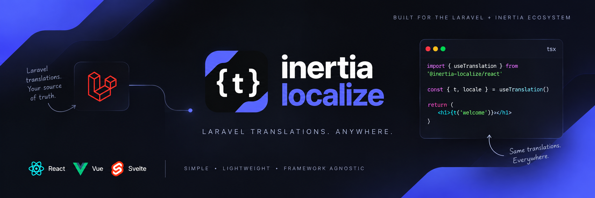

<p align="center">
  
</p>

# Inertia Localize

Inertia Localize brings Laravel's localization to Inertia applications through small, framework-native frontend adapters. Laravel remains the source of truth for locales, translations, and fallback behavior; Inertia delivers the active locale and selected messages with page props.

> Project status: early development. Package APIs are still being implemented.

## Packages

| Path | Package | Responsibility |
| --- | --- | --- |
| `packages/laravel` | `jiordiviera/inertia-localize` (Composer) | Locale handling, translation export, and Inertia props |
| `packages/core` | `@inertia-localize/core` (npm) | Shared TypeScript translation utilities and types |
| `packages/react` | `@inertia-localize/react` (npm) | React adapter |
| `packages/vue` | `@inertia-localize/vue` (npm) | Vue adapter |
| `packages/svelte` | Planned | Reserved for a possible later adapter |

The initial release targets Laravel, Inertia, React, and Vue. Composer and npm packages follow the repository's lockstep version policy.

## Development

Use Node.js and pnpm for the JavaScript workspace. Composer manages the Laravel package independently.

```sh
pnpm install
pnpm build
pnpm test
pnpm --filter @inertia-localize/core build
pnpm --filter @inertia-localize/core test
composer install --working-dir=packages/laravel
composer test --working-dir=packages/laravel
```

The root pnpm commands delegate to package scripts when present. The core package currently provides build and test commands; lint scripts will be added with package tooling. See [CONTRIBUTING.md](CONTRIBUTING.md) for the issue, branch, and pull request workflow, and [PACKAGE_PLAN.md](PACKAGE_PLAN.md) for package responsibilities and open design questions.
